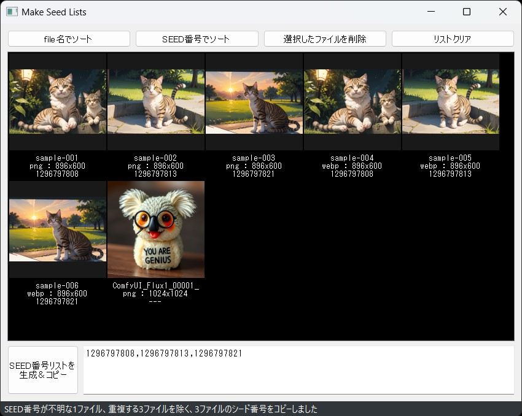

## MakeSeedListsについて
StableDiffusionで作成したPNG,JPG,WEBP画像をドラッグ＆ドロップしてSEED番号のリスト文字列を作成するツールです  
AdetailerやHighRes、UpScaleなしで生成しておいて、一部のSEEDだけ時間をかけて生成するような場合に、
X/Y/Z plotのSeedリストとして利用できるテキストを生成します  

## インストール方法（簡易）
[簡易インストール版zipのダウンロード] https://github.com/nekotodance/MakeSeedLists/releases/download/latest/MakeSeedLists.zip

- zipファイルを解凍
- 解凍したフォルダ内の「MakeSeedLists-install.ps1」を右クリックして「PowerShellで実行」を選択
- イントールの最後にデスクトップにリンクをコピーするかどうかを聞いてきます  
「"Do you want to copy the shortcut to your desktop? (y or enter/n)」  
必要があれば「y」入力後、もしくはそのまま「enter」キー  
必要なければ「n」入力後「enter」キー  
- MakeSeedListsリンクが作成されます

リンクファイルをダブルクリックして起動できます

## インストール方法（手動）
#### 必要なライブラリ
    PyQt5 Image pyperclip
#### 動作確認
    py SdImageDietGUI.py

## 利用方法
#### 1)アプリ上に複数の画像ファイルかフォルダをドラッグ＆ドロップしてください  
Stable Diffusionで出力したPNG、JPG、WEBPの画像ファイルに対応しています  
リストはクリアしない限り追加で登録していきます  

注意：フォルダをDropした場合は下層フォルダを再帰的にチェックします。サムネイル作成が結構重いので一度に追加するのは100ファイルくらいまでにしてください  

#### 2)リストの操作  
###### 2-1) file名でソート
ファイル名でソートします  
###### 2-2) seed番号でソート
シード番号でソートします  
###### 2-3) 選択したファイルを削除
選択した画像をリストから削除します  
Windowsの標準的なリスト操作（Ctrlを押しながらで追加選択など）が可能です  
この削除ボタン以外にもDeleteキーでも削除できます  
###### 2-4) リストクリア
リストをすべて削除します  

###### 3) SEED番号リストを生成＆コピー
リストからSEED番号リストを生成しテキストボックスへ表示、またコピーバッファへ格納します  
この際、ただの画像ファイルなどSEED番号が特定できないもの、SEED番号が重複するものは除いて生成します  
詳しくはステータスバー部の結果表示を参照ください  

#### status
ファイルの追加削除時は登録ファイル数、生成ボタン押下時は生成結果の概要を表示します  

## 注意事項
- サムネイル生成がかなり重いです、間違っても何千ファイルもの画像をドロップしないでください  

## 変更履歴
- 0.1.1 番号リストが表示順序通りに生成されていなかったのを修正  
- 0.1.0 初版  

以上
